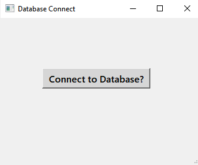
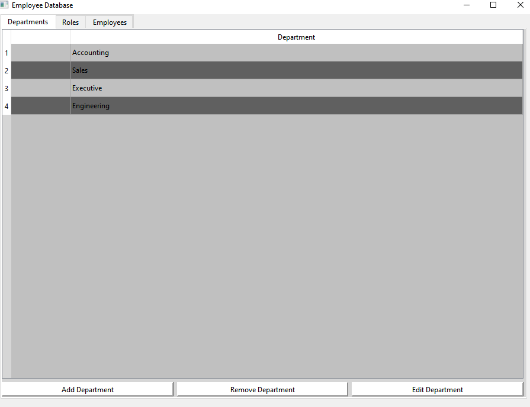
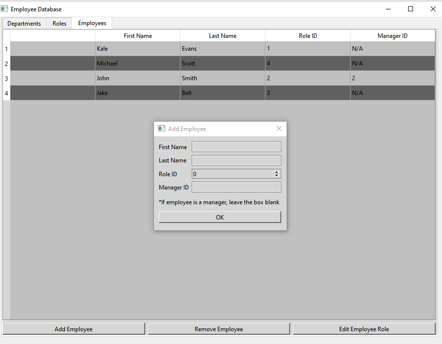

# Employee Tracker

## Purpose
Application built using QT Creator for a basic employee database. Purpose was to learn the QT IDE and design methods as well as interfacing with an SQL database.

## Built With
* C++
* QT
* qmake
* SQL

## Images

## Possible Future Additions
A lot of the code in the app is nearly identical, just with differing variables and data input. It might be beneficial to refractor the code for reusability. 
